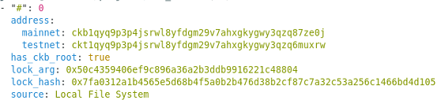
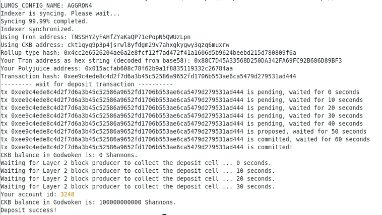
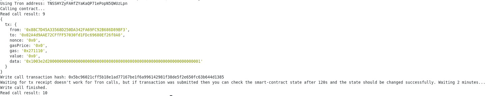

# Task 11

# A screenshot of the accounts you created (account list) in ckb-cli.


# A link to the Layer 1 address you funded on the Testnet Explorer.
https://explorer.nervos.org/aggron/address/ckt1qyq9p3p4jsrwl8yfdgm29v7ahxgkygwy3qzq6muxrw

# A screenshot of the console output immediately after you have successfully submitted a CKByte deposit to your Tron account on Layer 2.


# A screenshot of the console output immediately after you have successfully issued a smart contract calls on Layer 2.


#  The transaction hash of the "Contract call" from the console output (in text format).

# The contract address that you called (in text format).
0x02A4d9AAE72CFfFF57030fd1FDc69680Ef26f0A0

# The ABI for contract you made a call on (in text format).
```json
[

    {

      "inputs": [],

      "stateMutability": "payable",

      "type": "constructor"

    },

    {

      "inputs": [

        {

          "internalType": "uint256",

          "name": "n",

          "type": "uint256"

        }

      ],

      "name": "add",

      "outputs": [],

      "stateMutability": "payable",

      "type": "function"

    },

    {

      "inputs": [],

      "name": "getCurrentNumber",

      "outputs": [

        {

          "internalType": "uint256",

          "name": "",

          "type": "uint256"

        }

      ],

      "stateMutability": "view",

      "type": "function"

    }

]
```

# Your Tron address (in text format).
TNSSHYZyFAHfZYaKaQP71ePopN5QWUzLpn

