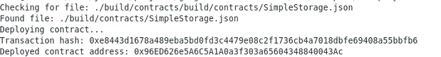

# Task 2

# A screenshot of the console output immediately after you have successfully deployed a smart contract.

# The transaction hash from the contract deployment (in text format).
0xe8443d1678a489eba5bd0fd3c4479e08c2f1736cb4a7018dbfe69408a55bbfb6

# The deployed contract address from the contract deployment (in text format).
0x96ED626e5A6C5A1A0a3f303a65604348840043Ac
