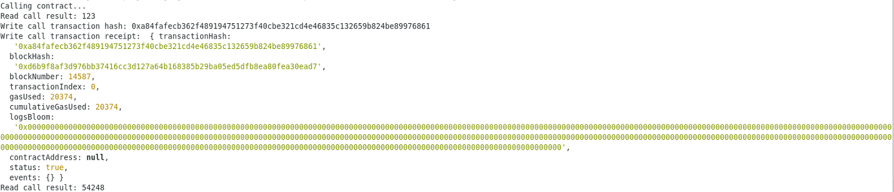

# Task 3

# A screenshot of the console output immediately after you have successfully issued a smart contract call.

# The transaction hash from the console output (in text format).
0xa84fafecb362f489194751273f40cbe321cd4e46835c132659b824be89976861

# The contract address that you called (in text format).
0x96ED626e5A6C5A1A0a3f303a65604348840043Ac

# The ABI for contract you made a call on (in text format).
[
    {
      "inputs": [],
      "stateMutability": "payable",
      "type": "constructor"
    },
    {
      "inputs": [
        {
          "internalType": "uint256",
          "name": "x",
          "type": "uint256"
        }
      ],
      "name": "set",
      "outputs": [],
      "stateMutability": "payable",
      "type": "function"
    },
    {
      "inputs": [],
      "name": "get",
      "outputs": [
        {
          "internalType": "uint256",
          "name": "",
          "type": "uint256"
        }
      ],
      "stateMutability": "view",
      "type": "function"
    }
]
