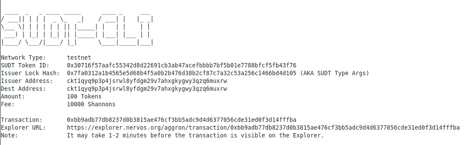
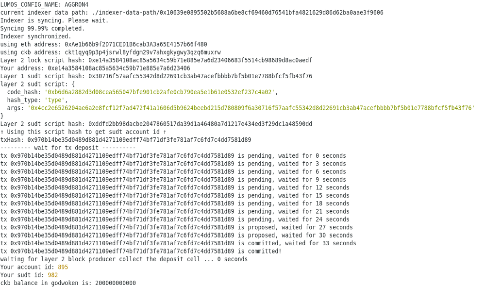
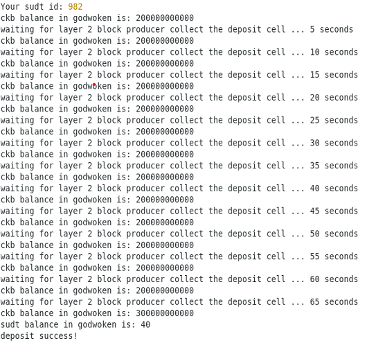

# Task 4

# A link to the Layer 1 address you funded on the Testnet Explorer.
https://explorer.nervos.org/aggron/address/ckt1qyq9p3p4jsrwl8yfdgm29v7ahxgkygwy3qzq6muxrw

# A screenshot of the console output immediately after using sudt-cli to create your SUDT tokens on Layer 1.

# A link to the transaction ID created by sudt-cli on the Testnet Explorer.
https://explorer.nervos.org/aggron/transaction/0xbb9adb77db8237d0b3815ae476cf3bb5adc9d4d6377056cde31ed0f3d14fffba

# A screenshot of the console output immediately after you have successfully submitted a deposit to Layer 2 using the account-cli tool.

# The SUDT ID from the console output after executing the deposit script (in text format).
982
