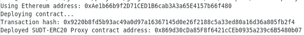
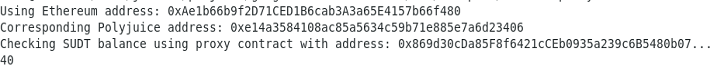

# Task 5

# A screenshot of the console output immediately after deploying smart contract.

# The address of the ERC20 Proxy Contract you deployed (in text format).
0x869d30cDa85F8f6421cCEb0935a239c6B5480b07

# A screenshot of the console output immediately after checking your SUDT balance.

# The Ethereum address that was checked (in text format).
0xAe1b66b9f2D71CED1B6cab3A3a65E4157b66f480
