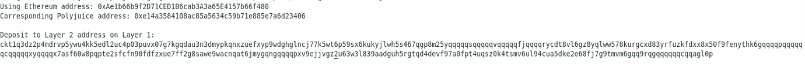

# Task 6

# A screenshot of the console output immediately after you have successfully generated your Deposit Receiver Address.

# Your Deposit Receiver Address (in text format).
ckt1q3dz2p4mdrvp5ywu4kk5edl2uc4p03puvx07g7kgqdau3n3dmypkqnxzuefxyp9wdghglncj77k5wt6p59sx6kukyjlwh5s467qgp8m25yqqqqqsqqqqqvqqqqqfjqqqqrycdt8vl6gz8yqlww578kurgcxd83yrfuzkfdxx8x50f9fenythk6gqqqqpqqqqqqcqqqqqxyqqqqx7asf60w8pqpte2sfcfn90fdfzxue7ff2g8sawe9wacnqat6jmygqngqqqqpxv9ejjvgz2u63w3l839aadguh5rgtqd4devf97a0fpt4uqsz0k4tsmv6ul94cua5dke2e68fj7g9tmvm6gqq9rqgqqqqqqcqqagl0p

# The Ethereum address used to generate the Deposit Receiver Address (in text format).
0xAe1b66b9f2D71CED1B6cab3A3a65E4157b66f480

# A link to the Etherscan explorer for the successful Force Bridge transaction. 
https://rinkeby.etherscan.io/tx/0xa2296ab667c991626d60195cc97012b46c4e790e794977fcc200e8947784353e

# A link to the Nervos explorer for the successful Force bridge transaction. 
https://explorer.nervos.org/aggron/transaction/0x70cf19ef16d441c35ff3fd53cb8dfb65efbb5608b880d84e63f377c7b70a854c
