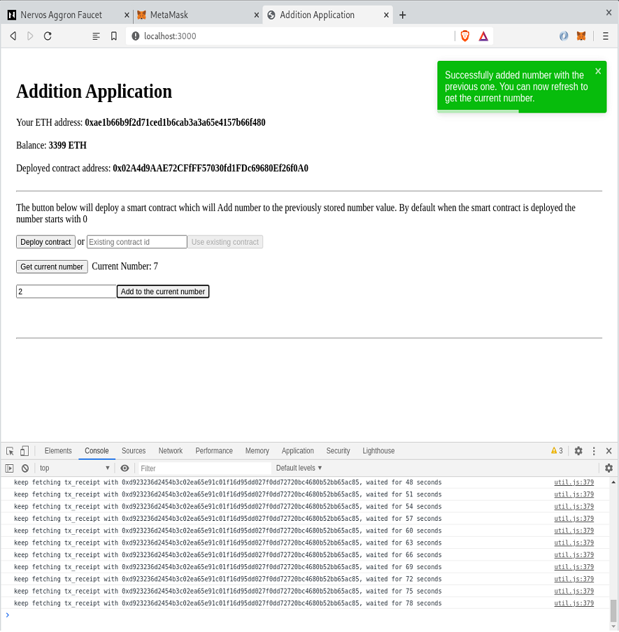
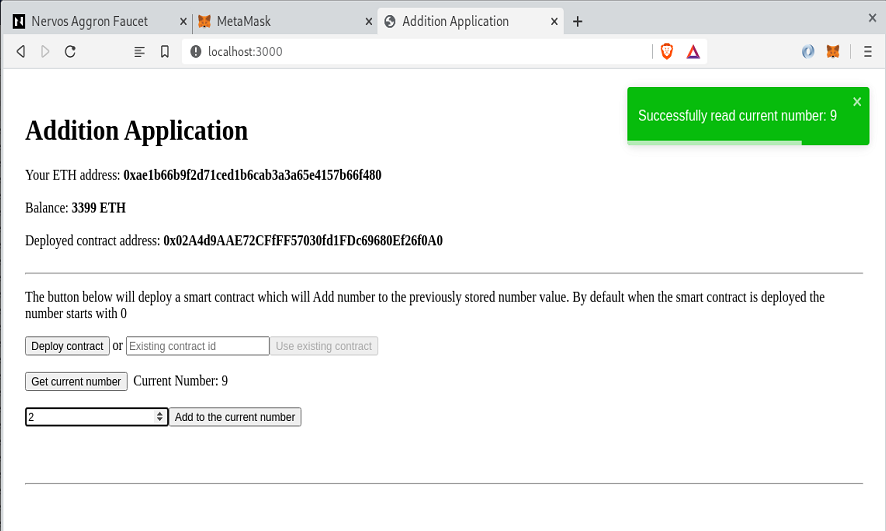

# Task 7

# Screenshots or video of your application running on Godwoken.



# Link to the GitHub repository with your application which has been ported to Godwoken
https://github.com/celoaken/gitcoin-nervos/tree/main/task7

# If you deployed any smart contracts as part of this tutorial, please provide the transaction hash of the deployment transaction, the deployed contract address, and the ABI of the deployed smart contract. (Provide all in text format.)
0x36e38130d02f4ee2f712075c0a7de75b114209cab88a52039b034cd430d23e7c
0x02A4d9AAE72CFfFF57030fd1FDc69680Ef26f0A0
```json
[

    {

      "inputs": [],

      "stateMutability": "payable",

      "type": "constructor"

    },

    {

      "inputs": [

        {

          "internalType": "uint256",

          "name": "n",

          "type": "uint256"

        }

      ],

      "name": "add",

      "outputs": [],

      "stateMutability": "payable",

      "type": "function"

    },

    {

      "inputs": [],

      "name": "getCurrentNumber",

      "outputs": [

        {

          "internalType": "uint256",

          "name": "",

          "type": "uint256"

        }

      ],

      "stateMutability": "view",

      "type": "function"

    }

]
```
