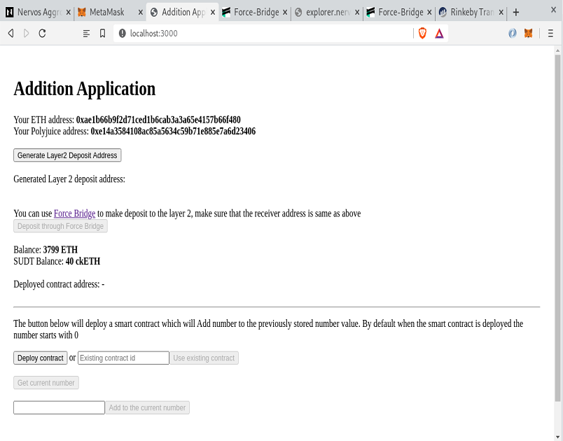
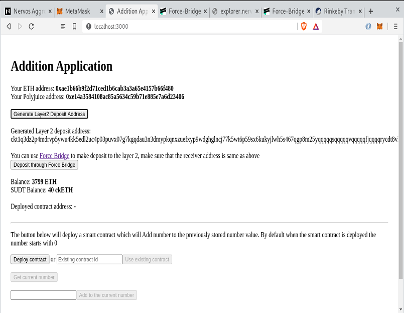
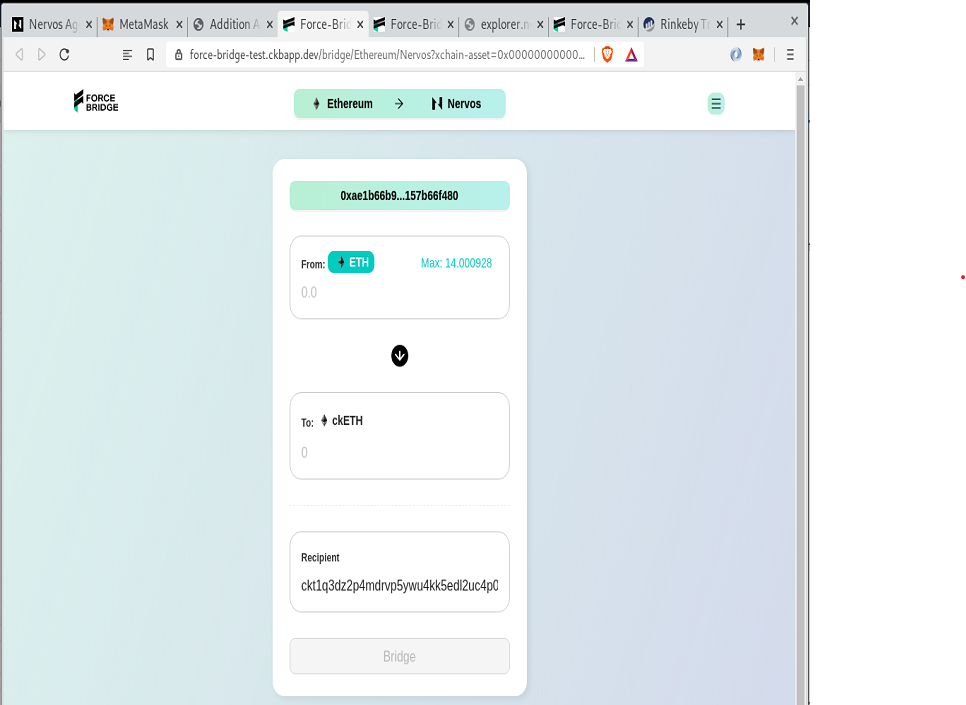

# Task 8

# A screenshot or video of your EVM application on Layer 2 with Force Bridge support.

User is presented with their ETH and Polyjuice address, ETH and ckETH balances and a button to generate layer 2 deposit address.

The user clicks on generate layer 2 deposit address and is shown the generated deposit address is text format, a button to deposit through Force Bridge unlocks

The user clicks on the button to Deposit through Force Bridge and is redirected to a new page which prefills the token (ETH) and the receiver address through request parameters

# The address of the SUDT-ERC20 Proxy Contract that you deployed (in text format).
0x869d30cDa85F8f6421cCEb0935a239c6B5480b07

# A link to the GitHub repository with your EVM application that integrates Force Bridge support.
https://github.com/celoaken/gitcoin-nervos/tree/main/task8

