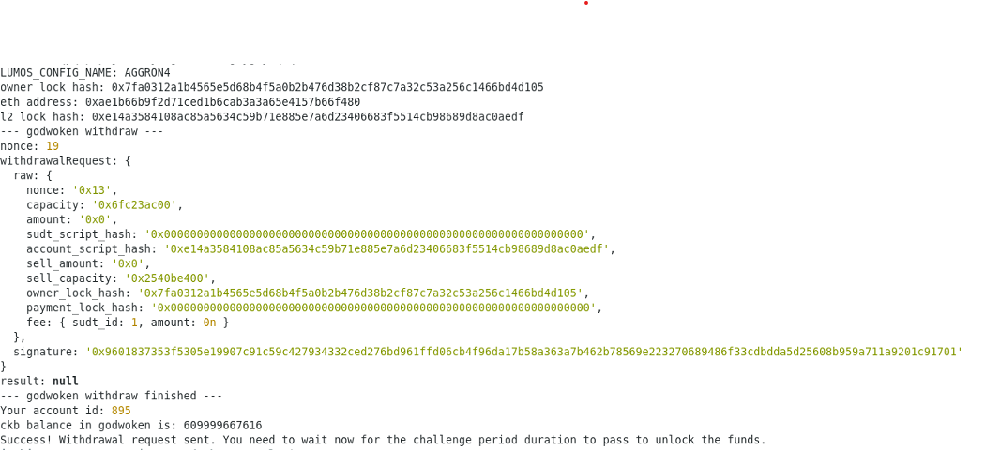

# Task 9

# A screenshot of the console output immediately after running the withdraw command.

# The Ethereum address that you've used for your Layer 2 account (in text format).
0xAe1b66b9f2D71CED1B6cab3A3a65E4157b66f480

# The Nervos Layer 1 address that you passed to withdraw command (in text format).
ckt1qyq9p3p4jsrwl8yfdgm29v7ahxgkygwy3qzq6muxrw
